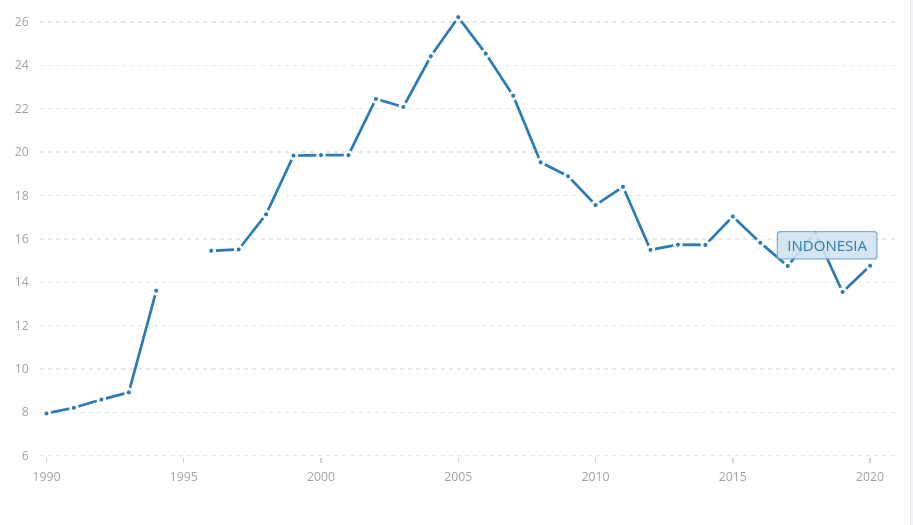

## Welcome to my website

I am PhD candidate in economics at Research School of Economics, The Australian National University. My research interest lies between labor economics, gender economics and development economics. My main research topic is female labor force participation in Indonesia.

##[Updated CV/ Resume](https://jnmarshan.github.io/docs/jmCV_V2.pdf)

## Recent work in progress 

### Intergenerational link of female labor force participation: Evidence from Indonesia
I provide evidence of the importance of mother participation and daughter participation in the next generation. I use Indonesia Family Life Survey (IFLS), a rich longitudinal data in Indonesia, estimate the correlation between mother's labor force participation at daughter's childhood and daughter's future labor market outcomes. I also estimate such intergenerational link in terms of permanent component of employment following literature in intergenerational income mobility.  I find that such intergenerational link exists. The effect size is not trivial, as three times as, additional year of schooling. Pro-equality (traditional) community belief strengthens (negates) this intergenerational link.  
  
*Illustrations only, all credits to [roxanabalint ](https://www.vectorstock.com/royalty-free-vectors/vectors-by_roxanabalint). Not taken from my paper.*  

### Scarring effects of prolonged jobless growth in Indonesia.
I investigate the existence of scarring effects of prolonged jobless growth in Indonesia between 1995-2005. The identification strategy relies on exogenous variation of unemployment rate at province level at year of one’s labor market entry. I use SAKERNAS and SUSENAS dataset to establish a cohort-panel analysis following Oreoupoulos, et al (2012). I use double-weighted unemployment rate (Hawden and Von Wachter, 2019) to deal with identification issues of the when and where a cohort enter the labor market. I use Census 1980-2010 to construct matrix of migration by education level among provinces as weight to the assignd unemployment rate. My results suggest scarring effects do exist, where unemployment rate at labor market entry age negatively affects labor force participation. I also find the estimated scarring effects for females in rural areas is almost twice larger than in urban areas. I find evidence that scarring effects hurt females more than their males counterparts. Lastly, cohort analysis shows that those who supposedly enter the labor market during the economic crisis experience larger scarring effects. 

### Beyond stagnation: The case of precarious drop of labor force participation of younger female in rural area
Despite significant improvement in education and health access, younger cohort of female living in rural area opt out from labor force participation. I employ age-period-cohort analysis to decompose salient factors of this sizable drop in FLFP for young women in rural area. I find that, apart from successful national-wide family planning program, child-bearing related factors has drive the participation down.

## Contact:
Crisp Building, Rm 2075  
College of Busines and Economics  
25a Kingsley St.  
Acton, ACT, 2601  
Australia

Email: [joseph.marshan@anu.edu.au](mailto:joseph.marshan@anu.edu.au)  
Twitter: [@josephmarshan](https://twitter.com/JosephMarshan)  
Linkedin: [jmarshan](https://www.linkedin.com/in/jmarshan/)

### Other links:
[SMERU profile](https://www.smeru.or.id/en/content/joseph-natanael-marshan)   
[ANU webpage](https://www.cbe.anu.edu.au/about/staff-directory/?profile=Joseph-Marshan)
